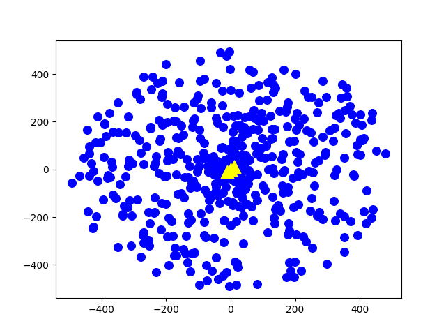
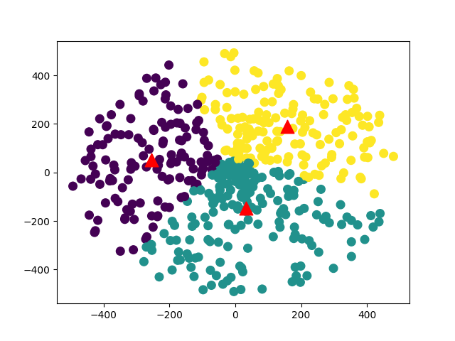

# kmeans-cuda

k-means clustering is a method of clustering which aims to partition n data points into k clusters (n >> k) in which each observation belongs to the cluster with the nearest mean.  

The nearness is calculated by distance function which is mostly Euclidian  distance or Manhattan distance.  
Parallel kmeans cuda and sequential Kmeans algorithm is compared.  

   
  <a align="center"> Datapoints to be clustered</a>

   
  <a align="center"> Clustered Datapoints (k = 3)</a>

Kmeans is powerful algorithm used on images. Its used to cluster the image pixel values into different bins (k value) to reduce the image information required to store the image. Widely used in image compression.

   
  <a align="center"> Colloseum Image</a>

   
  <a align="center"> Clustered Colloseum Image (k = 8)</a>

